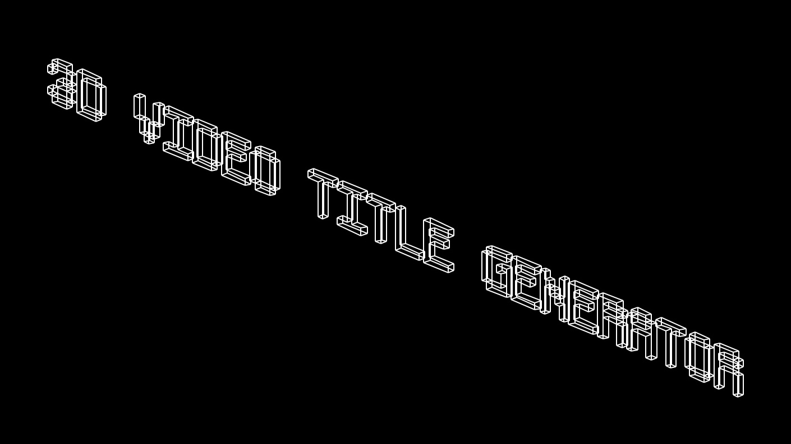
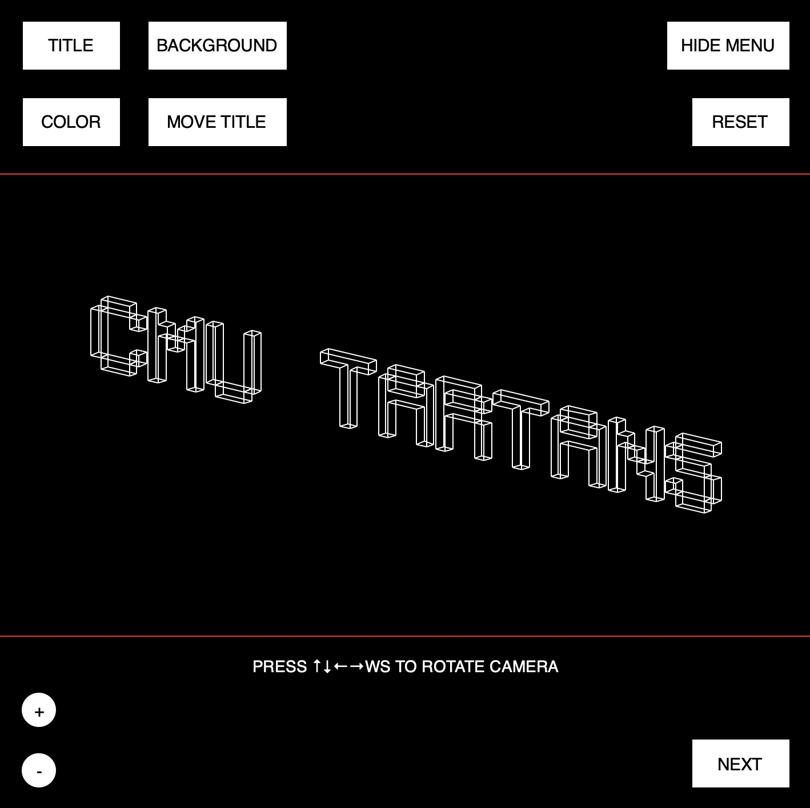
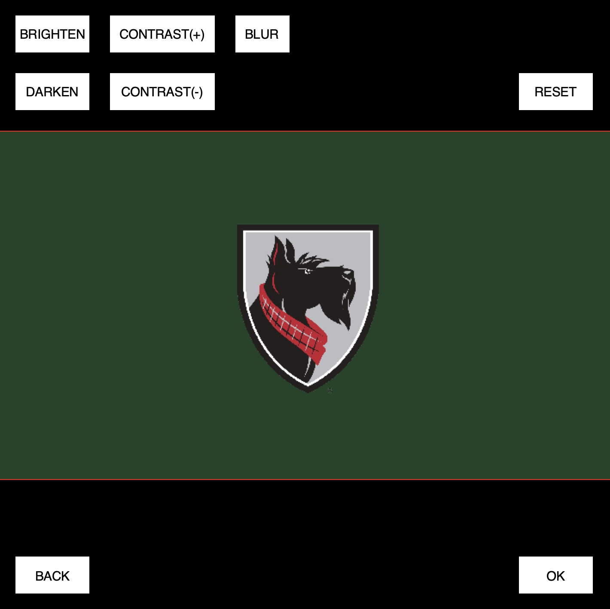
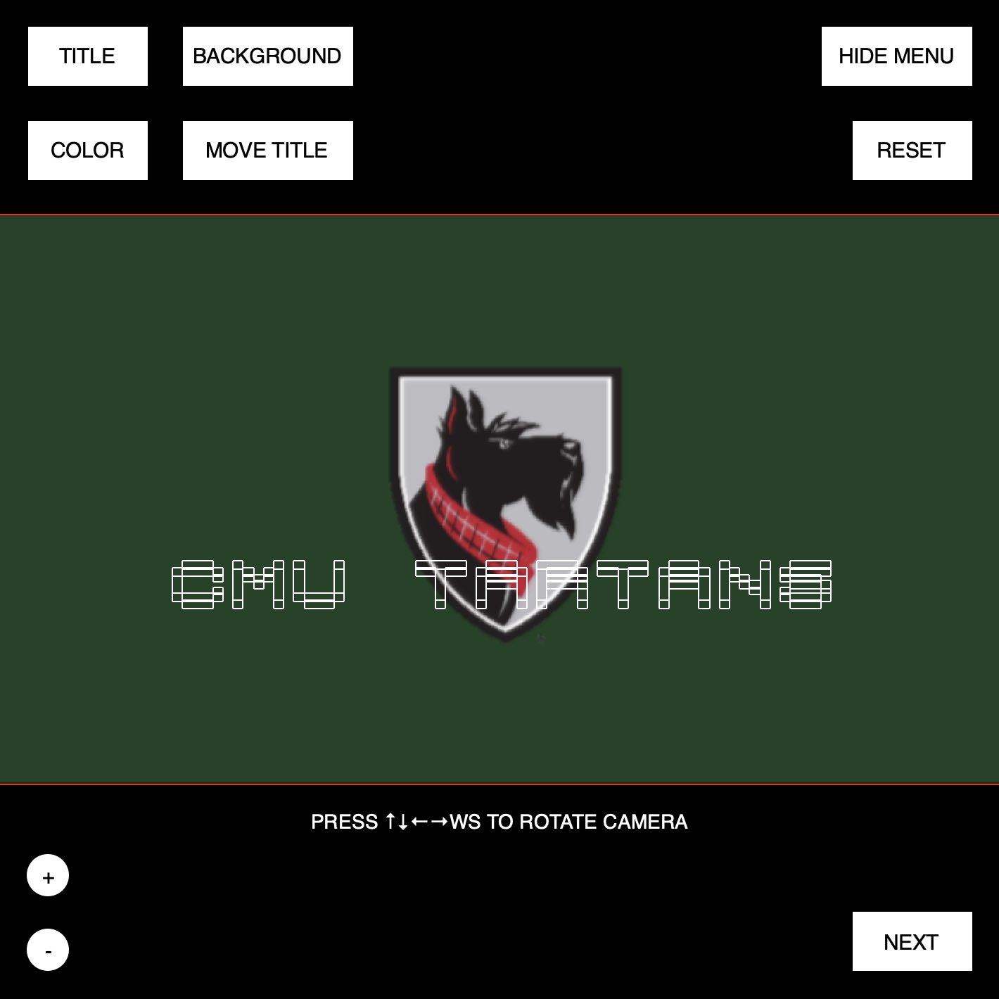
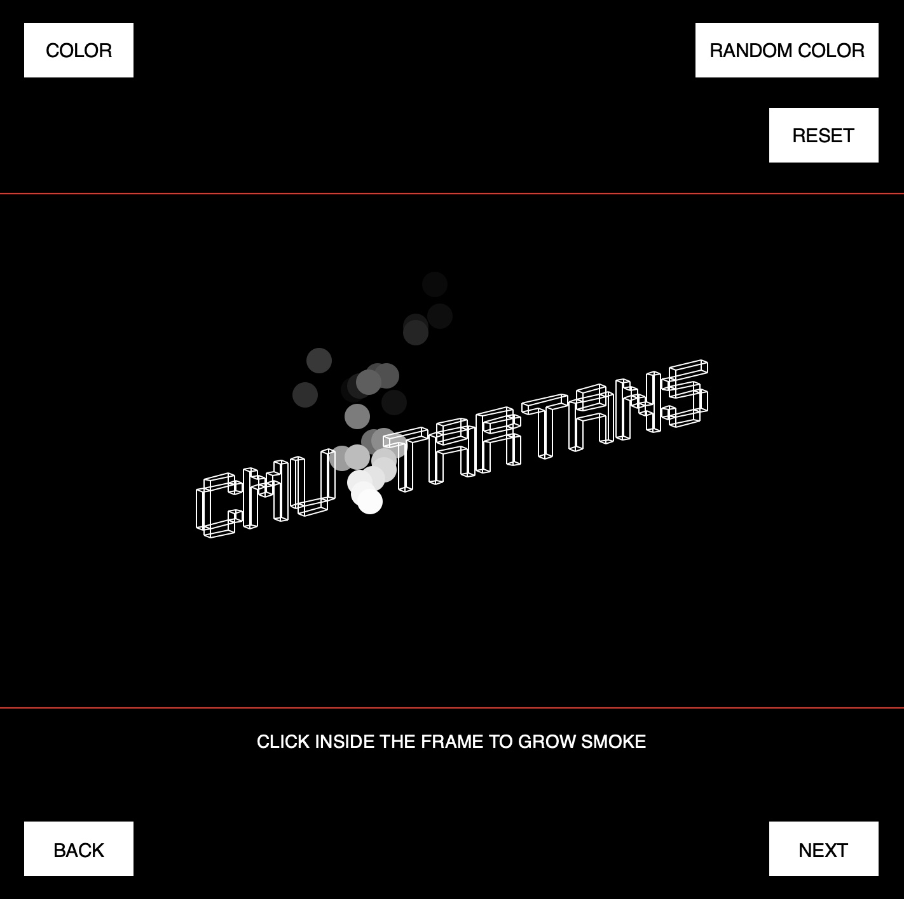

[GitHub Repo](https://github.com/fakeveliu/3D-Video-Title-Generator) | [Video Demo](https://www.youtube.com/watch?v=_HKwtrwD1u4)
> An application that generates a 3D title intro for your video with background customization and built-in effects presets.

This is my final term project for the course Fundamentals of Programming and Computer Science at CMU. It's the first programming course I took at CMU and also the course that led me into coding. I was one of those students who didn't have much coding experience before coming into college, but this course transformed me from that into someone who's able to propose a full appliacation development plan and write thousands of lines of code independently.

When I was deciding what to do for the term project, I started by thinking about what I enjoy doing in life. The first thing that came to my mind was video editing. Today, millions of people watch online videos every day, but not too many of them notice how important a good intro is to a video. I had a lot of experience making video intros with softwares like Final Cut Pro, and I decided that it might be cool to write an app to create my own themed video title intro.

Looking back at this application, I feel that it's such a simple program with almost no UI design, but the genuine happiness of knowing how much I learned and grew in that class always stays within.

## 3D Projection ##
To get a 360° rotatable and scalable preview of the title, `numpy` matrices are used for projecting 3D letters to 2D screen space. I designed the inner structure for each of the 26 letters (uppercase) and numbers 0-9, giving them a consistent wireframe look. The challenging part is probably finding a way to draw the lines efficiently by specifying the order in which the points are connected.

* Preview of the title "CMU TARTANS"

## Customization ##
The background can be set to an image uploaded from device. I implemented a few image editing functions so that the user can adjust the brightness and contrast of the image, and apply a blurring effect to it. You may also move the title around to make it better stand out.
* Before blurring:

* After blurring + re-positioning title:

## Built-in Presets ##
To add to the flexibility, I created a simple particle system that can simulate smoke and firework. You can also drag your mouse to define the path of a glow trail. These animated effects serve to enhance the visual apperance of your title which is the last step before exporting your intro. Since they consist of dynamic particles, the [video demo](https://www.youtube.com/watch?v=_HKwtrwD1u4) should provide you a better sense of how they look. Here I'm only going to show you the smoke effect:

