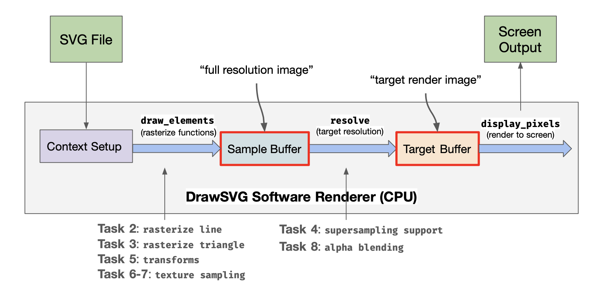
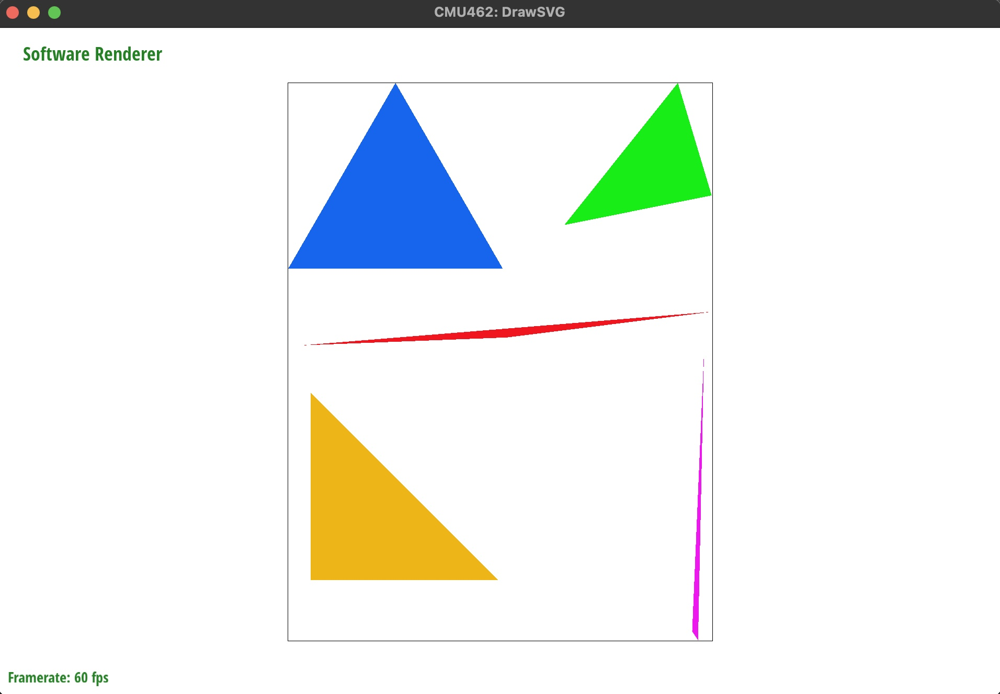
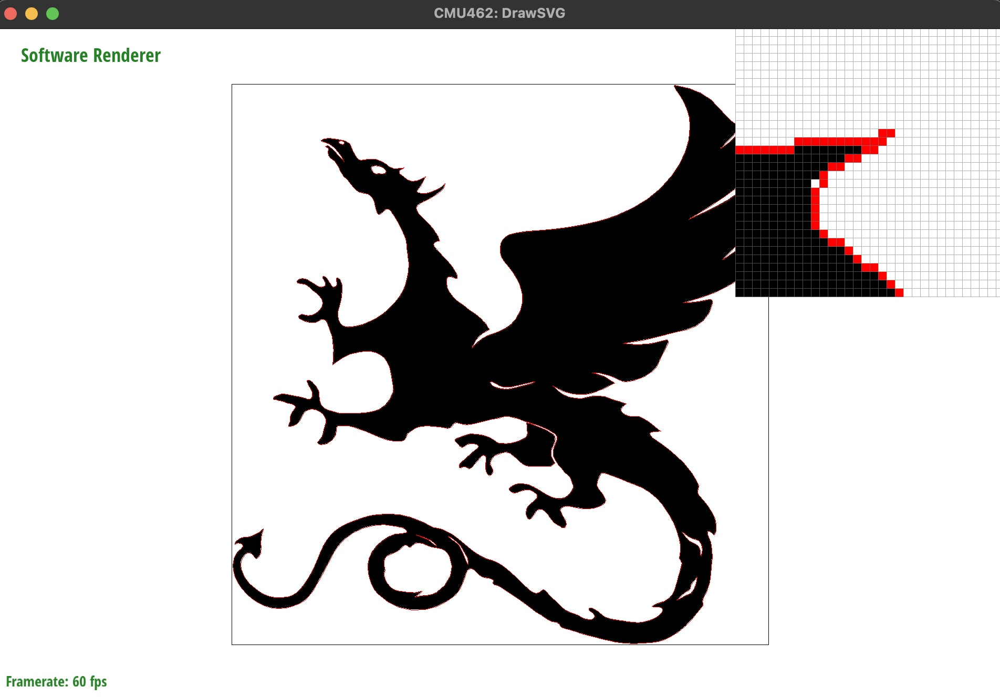
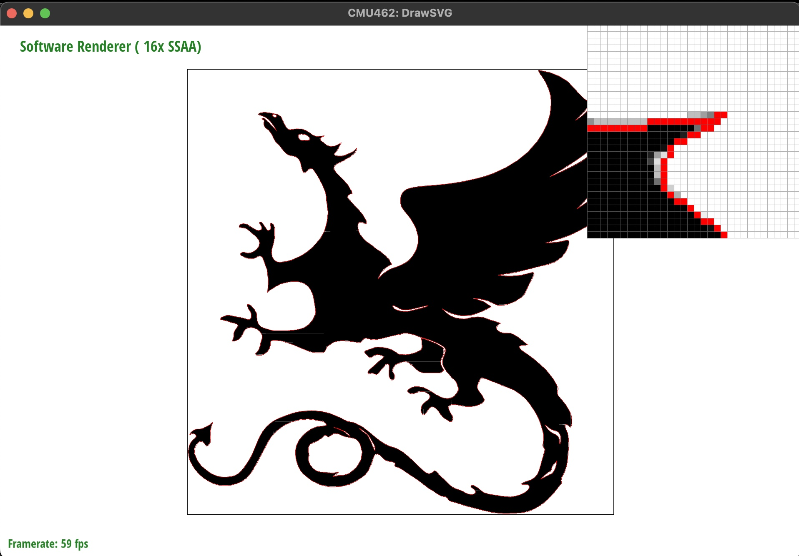
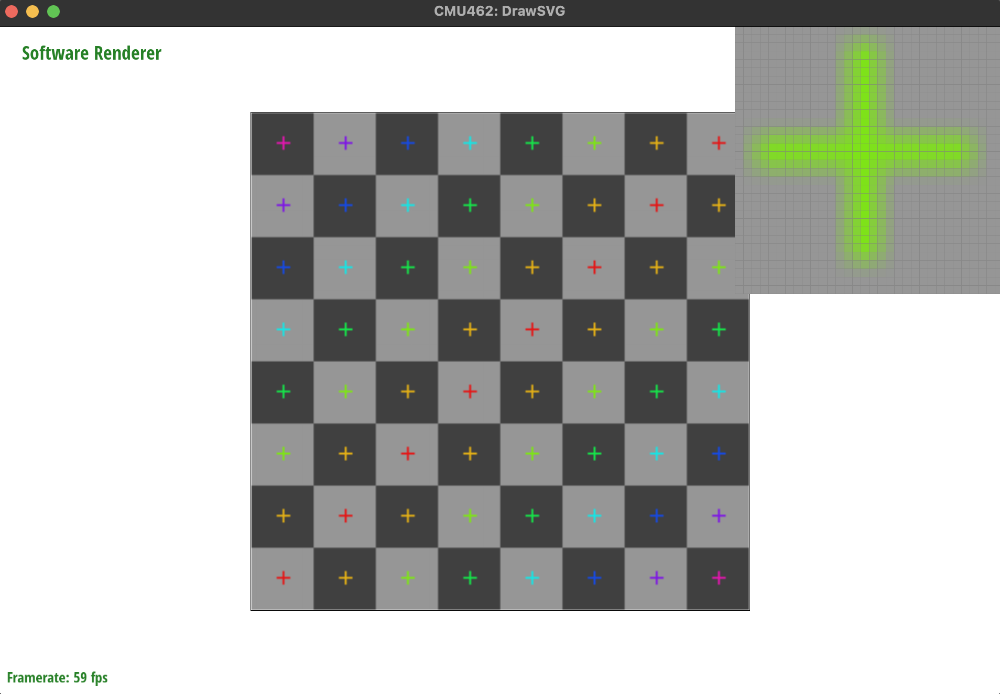
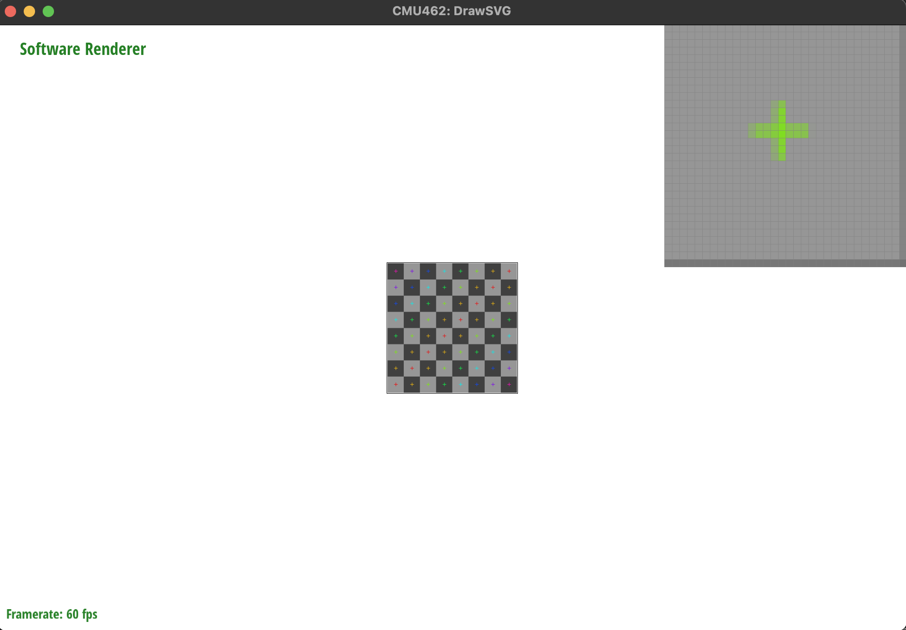
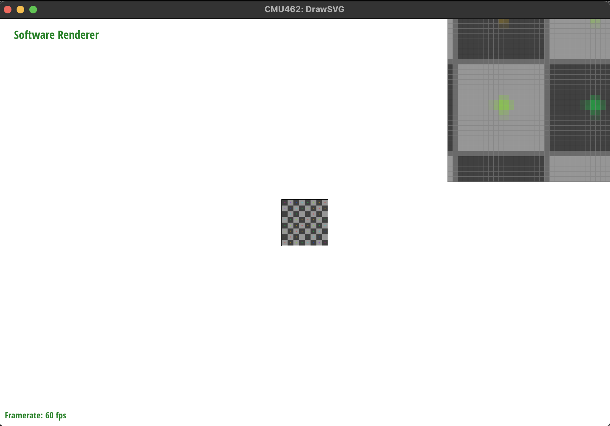
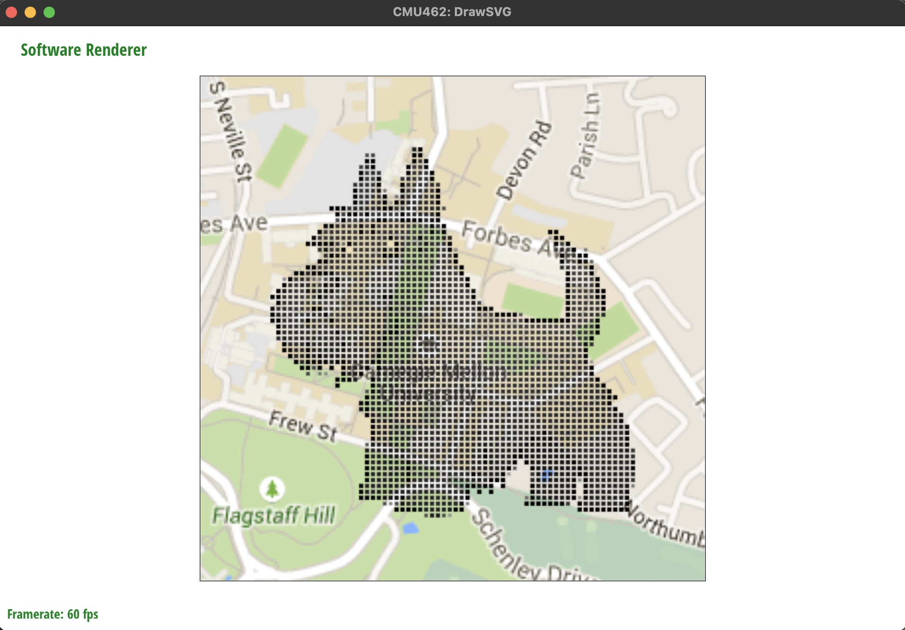
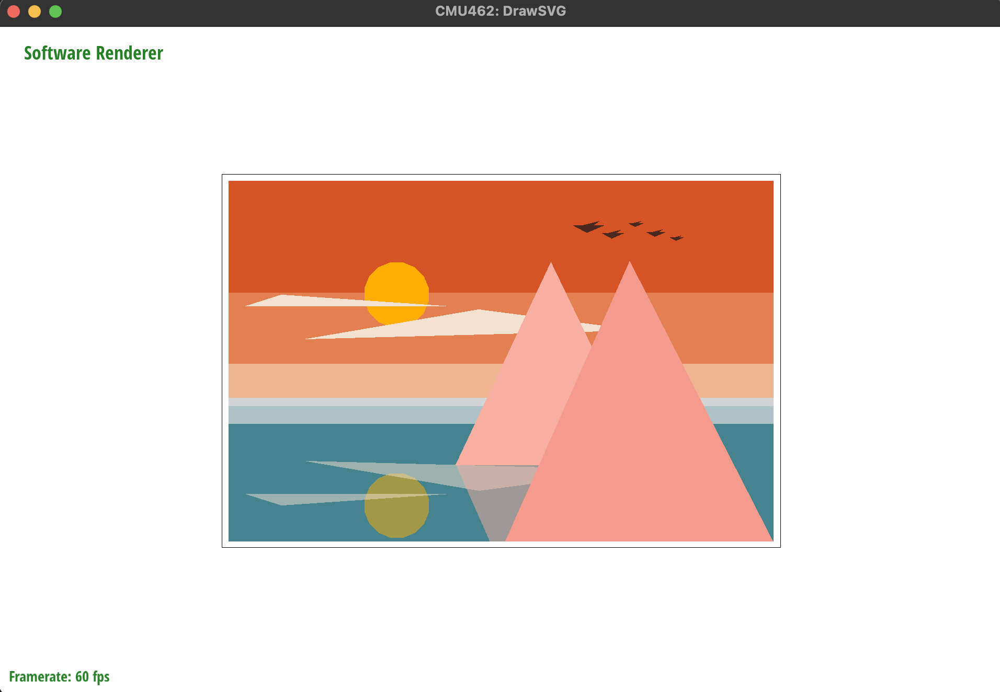

[GitHub Repo](https://github.com/CMU-Graphics/DrawSVG) | [Documentation](https://github.com/CMU-Graphics/DrawSVG/blob/master/README.md)
> A simple software rasterizer that draws basic primitives and bitmap images in a viewer that supports features of the Scalable Vector Graphics (SVG) format.

DrawSVG is a project I did in the course Computer Graphics at CMU, utilizing important concepts in modern 2D rendering pipelines such as rasterization, sampling, perspective projection, depth and transparency, and so on. Below are some highlights in this projects.

## Rasterization ##
To draw basic primitives on the canvas, I implemented the following functions:
* `rasterize_line()`, which converts non-integer vertex coordinates into screen sample positions and uses the Bresenham's Algorithm to draw lines of any slope on the screen. In terms of efficiency, it only considers the sample positions covered by the line rather than the entire canvas which takes much more work.
* `rasterize_triangle()`, which tests all the sample points in the bounding box of a triangle and uses cross products to check for triangle coverage.

## Supersampling ##
Anti-aliasing is a technique that prevents jagged lines when we zoom in on a raster image. In DrawSVG, I implemented supersampling (a method that addresses aliasing by sampling more points on a single pixel) to ensure smoothness of the triangle edges under various resolutions.

Specifically, supersampling is done by managing a larger sample buffer that stores more than 1 sample per pixel (rate specified by user) and averaging the RGB values of the samples in each pixel to obtain its finial value. We can then tweak the supersampling rate to get a nice view of the image even after zooming in.

* 1 sample/pixel:

* 16 samples/pixel:

## Transformations ##
An SVG file consists of a hierarchy of shape elements. Each element is associated with a modelling transform that defines the relationship between the element's local coordinate space and its parent's coordinate space. I applied matrices to correctly interpret the hierarchy and to support image pan and zoom while preserving the relative positions of the elements drawn.

## Image Anti-aliasing ##

## Alpha Compositing ##

