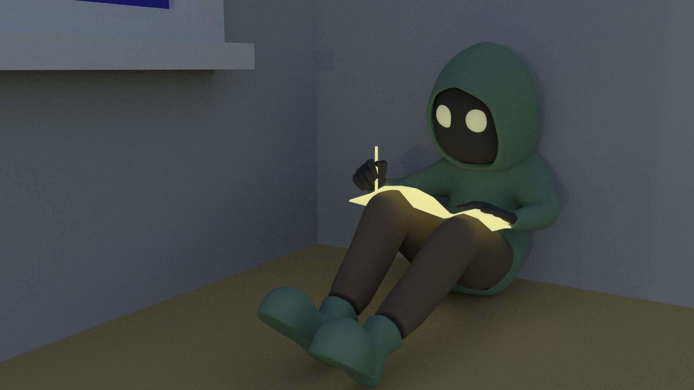
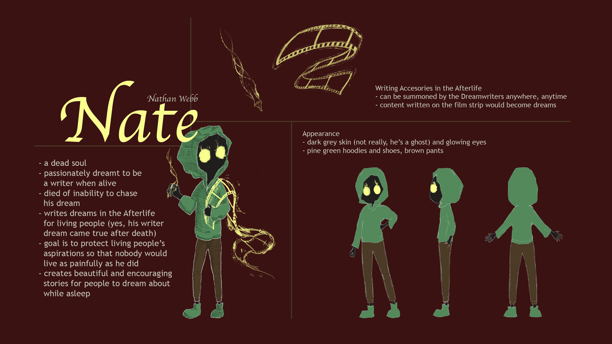
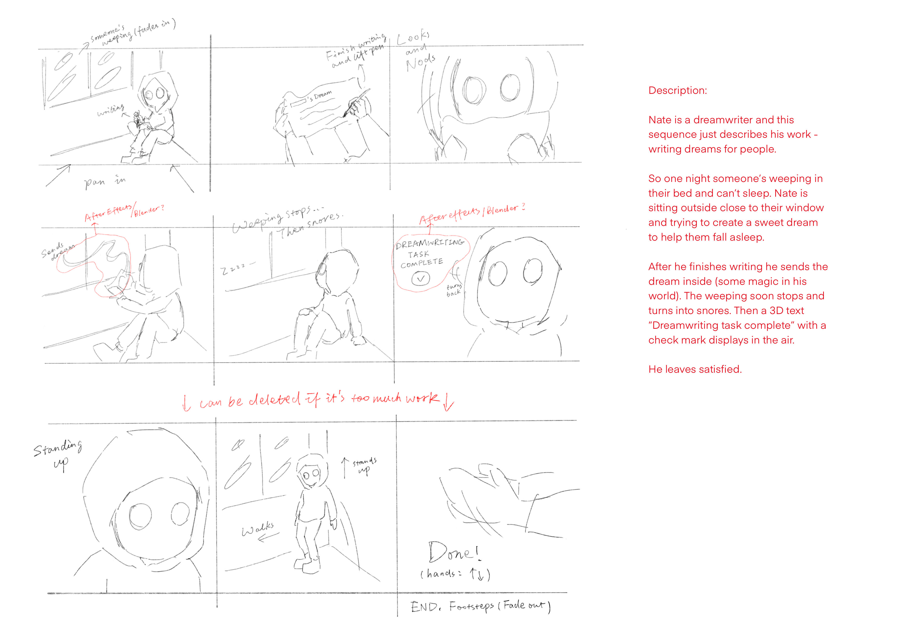
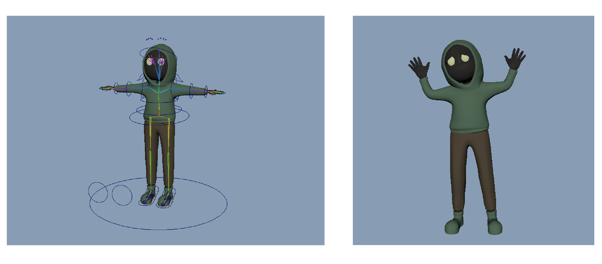

[Showcase Video](https://www.youtube.com/watch?v=1fceOg6SGZs)
> A short 3D animation film in which I was responsible for everything in the pipeline from character design, storyboarding, 3D modeling, rigging, to animation.

This is a semester-long project I did for the course Introduction to 3D Animation Pipeline at CMU. Before coming into the class, I knew nothing about Maya and the production pipeline of animated movies. All I had was passion for all the technicalities behind the stunning graphics we see on screens. It turns out that taking this class is a rewarding experience I will never forget.

The best part, which is also the challenging part of this project, is that I had full control of everything. I was not only the one who decided what to include in the film, but also the one who actually put in all the work to achieve the final goal. Self-monitoring became the esstential skill in this process, because oftentimes I needed to find a sweet spot between how much I already knew and how much time I had left to learn more and finish the work.

## Pre-production ##
Designing my own character was the very first task in the project. At that time, I had a pretty high expectation about what I could accomplish later, so I came up with a relatively detailed design about the character and the world he lives in.

My character's name is Nate. He's a dead soul residing in what's called *the Afterlife*, a place that people in his world go to after death. In the Afterlife, everyone does the same job of composing dreams for the living ones, called *Dreamwriting*. Nate is the kind of person who had a miserable life before death but responds with kindness to everyone he works for. The reason behind this is another long story to tell, which proved to be too much for a 30-second film, but I thought hard into it anyway - To me, extra work is always better than insufficient work. You can see in the illustration below that I even included a description about what the writing accesories should look like.

Later in the semester, I started storyboarding for the final film. The main goal here was to tell a story that others could understand using as few frames as possible while keeping it consitent with the character and world design.

## Using Maya ##
I didn't even know what the Maya interface looks like before taking this class, but after one semester of intense interaction I became quite familiar with a subset of its functionalities. During production in Maya, I was often surprised by how powerful modern graphics softwares are. A strong urge to dive deeper into their implementation eventually led to an incredibly fun experience in a course I took later, Computer Graphics.

It's super fulfilling to finish the whole *3D Modeling -> Texturing and UV Mapping -> Rigging and Skinning -> Camera, Lighting, and Environment Setup -> Animation -> Rendering* process on my own. Each stage had its own highlight as well as trickiness, but all of them equally contributed to my knowledge of and passion for 3D graphics.
* Nate, rigged and skinned

* Nate, rendered the first time
