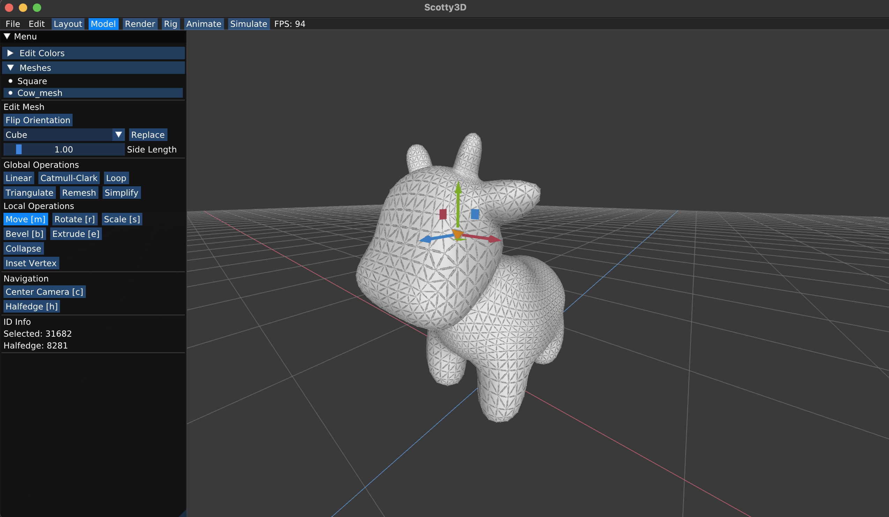
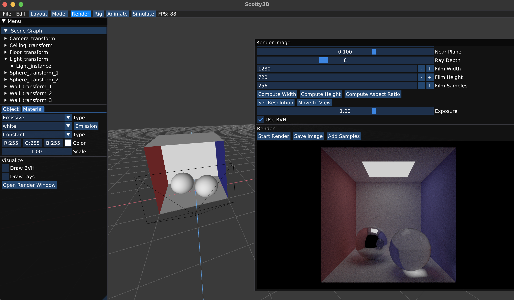
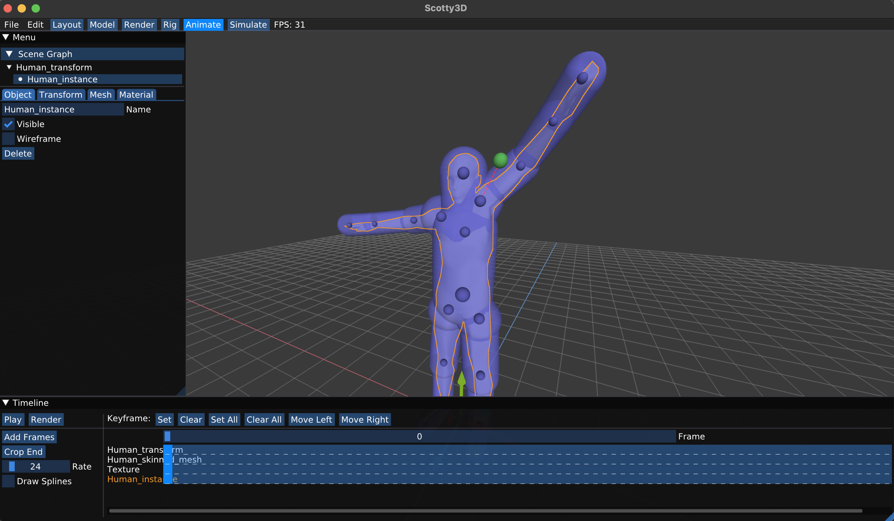
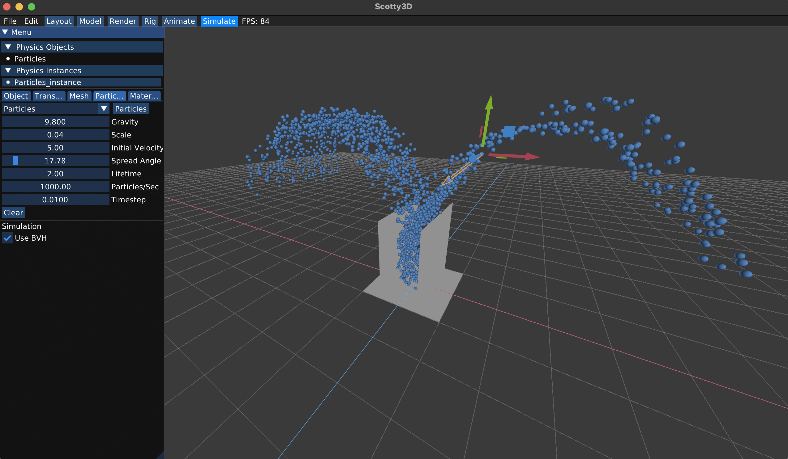

> Carnegie Mellon University’s educational graphics software package. Includes components for interactive 3D mesh editing, path tracing, dynamic animation, and physics-based simulation.


Scotty3D is an essential education tool used in the course Computer Graphics at CMU, where the students spend nearly the entire semester implementing features for its different components. By playing both the developer's and the user's role in this software application, they learn about many of the important topics in computer graphics.

In Spring 2022, I wrote functionalities including 3D mesh editing, path tracing, animation, and physics-based simulation as a student in the class. Details about what I did can all be found in the [documentation](https://cmu-graphics.github.io/Scotty3D/) which also serves as the assignment writeup website for the course.

* 3D Mesh Editing Interface:

* Path Tracing Interface:

* Dynamic Animation Interface:

* Physics-based Simulation Interface:


Over the summer, I joined the Computer Graphics staff as a Research Assistant to continue improving Scotty3D's codebase. My main responsibility was to help develop a new file format called S3D for all the 3D assets (meshes, textures, lighting, etc.) in the scene. Originally, Scotty3D used `assimp` to load and store scene data, which had the following issues:
* Took up a big chunk of the build time since it is a lot of code
* Did not match exactly the way internal data was structured (e.g. did not support halfedge meshes, the primary data structure used for the meshes in Scotty3D)

With the introduction of S3D, we are able to load and store scene data in a much more efficient and cleaner manner. The data chunks in a scene file now look like this:
```
's3dx' [4-byte size] [version] // scene or animator header
    'str0' [4-byte size] {array of characters used for asset names}
    'xxxx' [4-byte size] {array of bytes used for data in asset}
    'yyyy' [4-byte size] {array of structures with name, type, and data reference}
```
Besides writing the loader/saver code and ensuring its robustness, I created a format converter from OBJ to S3D, which allows the course staff to quickly import high-poly meshes used in previous semesters and rebuild example scenes for testing purposes.

I also helped debug the testing suite that is newly introduced to the course in Fall 2022. The debugging process revealed some ambiguities associated with how halfedge mesh connectivity is defined currently in Scotty3D. We'll have to think more about that, but all of the existing test cases created this summer are already comprehensive enough to greatly speed up students' debugging and the staff's grading process.

Now we're bringing the latest Scotty3D release to the Fall 2022 instance of our loving course and looking forward to seeing students interact with it. Feel free to try out the projects [here](https://github.com/CMU-Graphics/Scotty3D)!