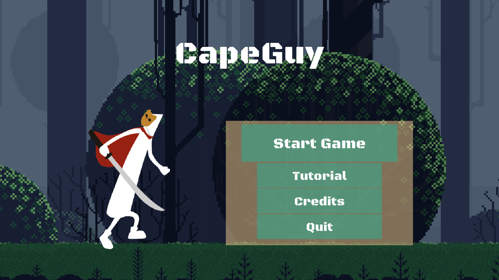
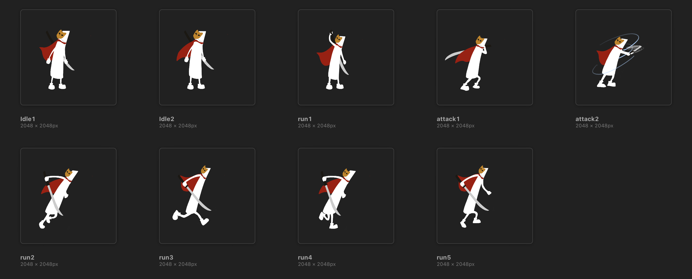
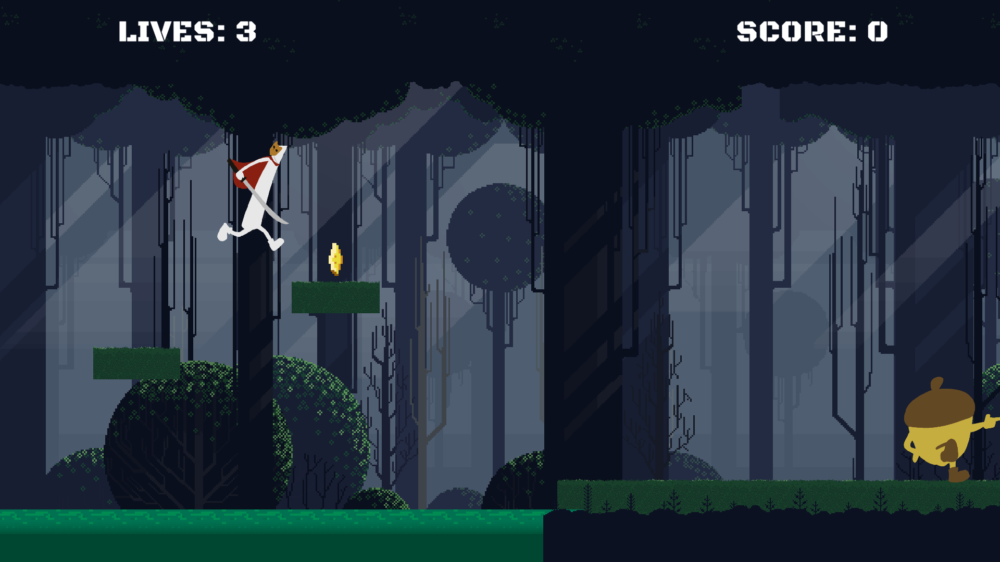
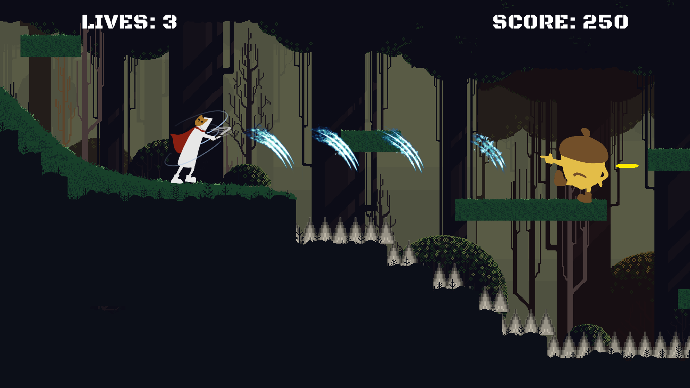
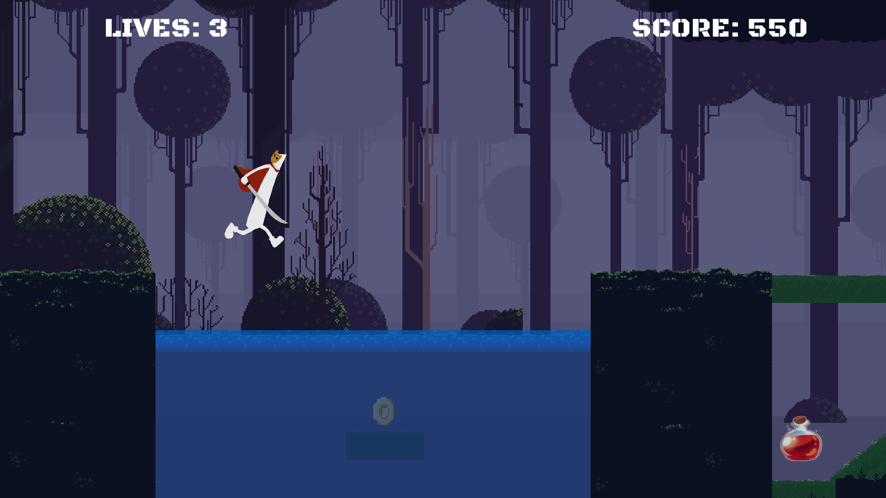
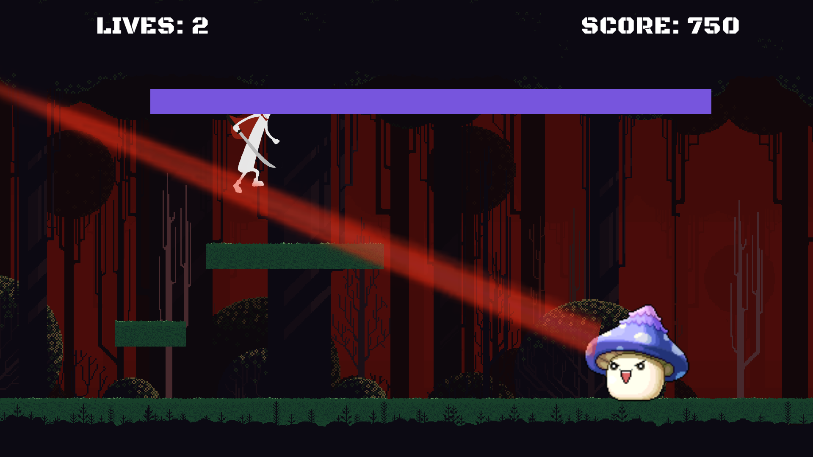

[GitHub Repo](https://github.com/fakeveliu/CapeGuy) | [Gameplay Video](https://www.youtube.com/watch?v=tRJ_BaRIuRc)
> A 2D platform adventure game. Along the journey, the player controls CapeGuy to fight enemies in the forest and collect coins to unlock new levels.

This is my final project for the course Understanding Game Engines at CMU. I had little knowledge about game engines before taking this course. I built up my skills by implementing components for different types of games each week, from simple ones like Pong to more involved ones like a 3D version of Astral Attack. Toward the end of the semester, we were learning to build a 2D platform game which is my favorite genre. I immediately decided to extend it to a full working game for my final project.

## Art Design ##
The first thing I needed to do was choosing a theme for the game. I started by browsing free assets online, and came across a forest environment package that quite suits an adventure game. I was drawn not only by its mysterious vibe, but also the flexibility provided by the multiple layers in it.

To match the background style, I came up with CapeGuy who wears a cape and a mask and uses a Japanese sword as weapon. The enemy type he'll encounter is AcornGuy who attacks by shooting from their fingers. It took me a while to draw all the frames, but everything's worth it after I animated them in Unity and saw them actually moving on screen.

## Gameplay Design ##
I'm a huge fan of hard platform games like Celeste and Ori, so I wanted to design the terrain in a way that's trickier for the player to go pass. You can see from the screenshots that the classic spikes, moving platforms, and contaminated water are all brought into CapeGuy.

The game consists of 4 levels, one of which is a boss fight with the mushroom in MapleStory. Along the journey, the player controls CapeGuy to avoid traps, collect potions and coins, and beat the AcornGuys to get to the final level (This is better illustrated in the [gameplay video](https://www.youtube.com/watch?v=tRJ_BaRIuRc)). The game mechanism is supported by C# scripts where I implemented the following global instances:
* Game Manager: manages game states, checkpoints, UI messages, and current player and enemies instance
* Level Manager: manages current level information and transitions between scenes according to the game state
* Sound Manager: plays sound corresponding to differnt events in game
* Camera Following: re-positions the camera so that CapeGuy is always on the left side of the screen, with slow-in and slow-out

as well as those that control individual object behavior:
* Characters: mutual interaction, or interaction with the environment (attacking, dying, passing checkpoints, etc.)
* Collectibles: interaction with the player (increases #lives/scores, or moves to the next level)
* Terrain elements: interaction with the player (decreases #lives)

All of the scripts are available in the [github repo]((https://github.com/fakeveliu/CapeGuy)).

